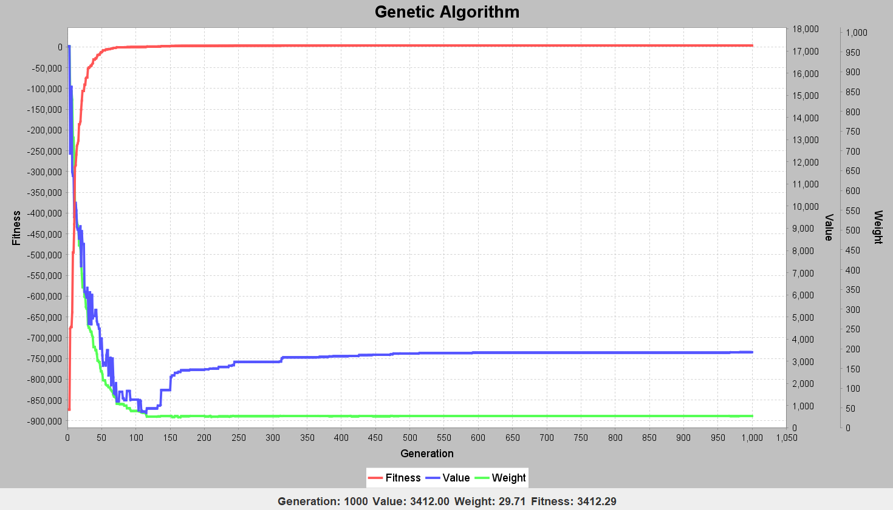

# Genetic Algorithm

A Java implementation of a generic Genetic Algorithm framework
for solving different optimization problems.

## Supported Problems

- Knapsack Problem
- Set Covering Problem
- Travelling Salesman Problem

## Features

- Generic chromosome system
- Selection
- Crossover
- Mutation
- Fitness evaluation
- Live fitness visualization

## Visualization

The algorithm's fitness progression can be monitored in real time.

## Requirements

- Java XX
- IntelliJ IDEA (optional)

## Dependencies

This project uses:

- Gson 2.14.0 — Apache License 2.0
- JFreeChart 1.5.6 — GNU Lesser General Public License (LGPL)

## Running

Run `Main.java` to start an experiment.